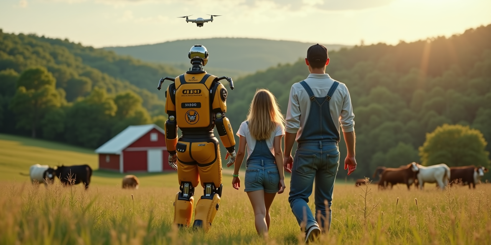

# AI for Rural Communities: Education & Opportunity Program

# AI for Rural Communities: Education & Opportunity Program

**Comprehensive curriculum bringing AI education to rural students through agriculture, FFA, and real-world applications.**

[](https://opensource.org/licenses/MIT)
[](https://www.ffa.org)
[](https://nces.ed.gov/surveys/ruraled/)

---

## 🌾 Mission Statement

Transform rural education by providing students in agricultural communities with cutting-edge AI and technology skills, creating pathways to high-paying careers while strengthening local agricultural economies.

**From "8 kids at Verona High School" to "transforming rural America through AI education."**

---

## 📊 Market Opportunity

- **AI in Agriculture Market Growth:** $4.7B (2024) to $9.4B+ by 2029 (25-26% CAGR)
- **Career Salaries:** $38k-$120k+ for agricultural technology specialists
- **Target Audience:** 9,000+ FFA chapters nationwide
- **Gap Addressed:** Rural students underrepresented in tech careers

**Sources**: GM Insights AI in Agriculture Market Report 2024, U.S. Bureau of Labor Statistics

---

## 🎯 Program Overview

### Complete 8-Module Curriculum
Each module designed for 3-4 weeks of instruction with hands-on projects, real industry applications, and career preparation.

| Module | Topic | Duration | Key Skills |
|--------|--------|----------|------------|
| **1** | [AI Foundations for Agriculture](curriculum/01-foundations/) | 3 weeks | Python, ML basics, agricultural applications |
| **2** | [Precision Agriculture & Data Science](curriculum/02-precision/) | 4 weeks | IoT sensors, data analysis, yield optimization |
| **3** | [Livestock Management & AI](curriculum/03-livestock/) | 3 weeks | Computer vision, animal monitoring, health analytics |
| **4** | [Drones & Autonomous Systems](curriculum/04-drones/) | 4 weeks | Drone operation, aerial imaging, autonomous navigation |
| **5** | [Smart Infrastructure & IoT](curriculum/05-infrastructure/) | 3 weeks | Sensor networks, edge computing, system integration |
| **6** | [Rural Business & Entrepreneurship](curriculum/06-business/) | 3 weeks | AI business models, market analysis, startup development |
| **7** | [Environmental Monitoring & Conservation](curriculum/07-environmental/) | 4 weeks | Water quality, soil health, conservation compliance |
| **8** | [Advanced AI Applications & Career Prep](curriculum/08-advanced/) | 5 weeks | Portfolio development, industry connections, job placement |

---

## 🚀 Expected Student Outcomes

### Program Goals & Career Targets
Based on similar Career & Technical Education programs in agriculture and technology:

- **Strong employment potential** in AgTech/related fields within 6-12 months
- **$42k-$48k average starting salary** (range: $38k-$52k, varies by role and location)
- **High job satisfaction** through meaningful work in agricultural technology
- **Continuing education pathways** to 2-year and 4-year agricultural and engineering programs
- **Entrepreneurship opportunities** for student-led agricultural technology ventures

### Skills Students Develop
- **Programming:** Python, JavaScript, R, SQL
- **AI/ML:** TensorFlow, computer vision, predictive analytics
- **Agriculture:** Precision farming, crop management, livestock monitoring
- **Hardware:** IoT sensors, drones, edge computing devices
- **Business:** Entrepreneurship, project management, industry networking

---

## 💼 Career Pathways

### Entry Level ($38k-$55k)
- Agricultural Data Analyst
- Precision Farming Technician
- IoT Agricultural Specialist
- Drone Operations Coordinator

### Mid-Level ($50k-$75k)
- Agricultural AI Developer
- Precision Farming Specialist
- Agricultural Data Scientist
- AgTech Product Manager

### Senior Level ($75k-$120k)
- Senior Agricultural AI Engineer
- Agricultural Research Scientist
- Senior AgTech Specialist
- Agricultural Technology Consultant

### Leadership Level ($95k-$160k+)
- AgTech Startup Founder
- Director of Agricultural Technology
- Chief Agricultural Innovation Officer
- Agricultural Technology Solutions Architect

---

## 🏫 Implementation Guide

### For Schools & Districts
1. **Start Small:** Begin with interested students and single module
2. **Build Partnerships:** Connect with local farms and AgTech companies
3. **Seek Funding:** Apply for USDA education grants and state funding
4. **Scale Gradually:** Expand to full curriculum as program proves successful

### For FFA Chapters
1. **Integrate with Existing Programs:** Enhance current agricultural education
2. **Competition Preparation:** Use for agricultural technology contests
3. **Community Engagement:** Showcase student projects to local farmers
4. **National Expansion:** Share successful models with other chapters

### For Individual Educators
1. **Professional Development:** Start with Module 1 to learn alongside students
2. **Industry Connections:** Leverage provided contact lists and partnership guides
3. **Continuous Learning:** Access to updated curriculum and emerging technologies
4. **Support Network:** Connect with other educators implementing the program

---

## 💰 Funding & Grants

### Federal Opportunities
- **USDA NIFA:** Education grants for agricultural innovation
- **NSF:** STEM education in rural communities
- **Department of Education:** Rural education achievement grants
- **USDA Rural Development:** Community facility programs

### State & Local
- **State Agriculture Departments:** Workforce development funding
- **Economic Development Agencies:** Rural innovation initiatives
- **University Extension:** Partnership and equipment sharing
- **Industry Partnerships:** Equipment donations and mentorship

### Estimated Program Costs
- **Startup:** $15,000-$25,000 (equipment, training, curriculum)
- **Annual Operation:** $8,000-$12,000 (materials, updates, events)
- **Cost per Student:** $400-$600 annually
- **ROI:** 10:1 based on student career outcomes and community impact

---

## 🤝 Industry Partnership Opportunities

### Target Partners & Collaboration Models
This program is designed to facilitate partnerships with leading agricultural technology companies:

- **Equipment Manufacturers** (John Deere, Case IH, AGCO): Equipment access and technical mentorship
- **Agricultural Data Companies** (Climate Corporation, Granular, FarmLogs): Data analytics training and internships
- **Local Farm Cooperatives:** Real-world project opportunities and community connections
- **University Extension Programs:** Research partnerships, expertise, and facilities access

### Partnership Benefits
- **For Companies:** Access to trained talent pipeline, CSR impact
- **For Students:** Real projects, mentorship, job opportunities
- **For Schools:** Equipment, expertise, industry validation
- **For Communities:** Economic development, technology adoption

---

## 📚 Curriculum Features

### Hands-On Learning
- **Real Projects:** Work with actual farms and agricultural challenges
- **Industry-Standard Tools:** Same software and hardware used by professionals
- **Measurable Impact:** Track water savings, cost reductions, yield improvements
- **Portfolio Development:** Students graduate with professional project showcases

### Current Technology Integration
- **Computer Vision:** Crop disease detection, livestock monitoring
- **IoT Sensors:** Soil moisture, weather monitoring, equipment tracking
- **Machine Learning:** Yield prediction, optimization algorithms
- **Drones:** Aerial imaging, field mapping, precision application
- **Edge Computing:** Real-time processing, offline operation

### Assessment & Certification
- **Project-Based:** Real-world applications with measurable outcomes
- **Industry Validation:** Reviews by agricultural technology professionals
- **Peer Collaboration:** Team projects and leadership development
- **Professional Portfolio:** GitHub repositories and project documentation

---

## 🌍 Impact & Vision

### Community Transformation
- **Keep Talent Local:** High-paying tech careers in rural communities
- **Agricultural Innovation:** Modernize local farming operations
- **Economic Development:** Attract AgTech companies to rural areas
- **Educational Excellence:** Position rural schools as innovation leaders

### Scalability Potential
- **National Reach:** 9,000 FFA chapters across United States
- **International:** Adaptation for global agricultural education
- **Technology Transfer:** Models for other rural industries
- **Policy Influence:** Evidence-based rural education policy development

---

## 🛠️ Technical Resources

### Repository Structure
```
ai-rural-education/
├── curriculum/           # Complete 8-module curriculum
│   ├── 01-foundations/   # AI basics and agricultural applications
│   ├── 02-precision/     # Precision agriculture and data science
│   ├── 03-livestock/     # Animal monitoring and health analytics
│   ├── 04-drones/        # UAV operations and autonomous systems
│   ├── 05-infrastructure/ # IoT and smart farm systems
│   ├── 06-business/      # Entrepreneurship and market analysis
│   ├── 07-environmental/ # Conservation and monitoring
│   └── 08-advanced/      # Career preparation and advanced applications
├── projects/             # Student project templates and examples
├── resources/            # Additional learning materials and references
├── partnerships/         # Industry collaboration guides
└── implementation/       # School deployment guidelines
```

### Technology Stack
- **Programming Languages:** Python, JavaScript, R
- **AI/ML Frameworks:** TensorFlow, PyTorch, scikit-learn
- **Hardware Platforms:** Arduino, Raspberry Pi, NVIDIA Jetson
- **Cloud Services:** AWS IoT, Google Cloud AI Platform
- **Agricultural Software:** John Deere Operations Center, Climate FieldView

---

## 📞 Get Started

### For Educators
1. **Review Curriculum:** Start with [Module 1](curriculum/01-foundations/)
2. **Join Community:** Connect with other implementing educators
3. **Request Demo:** Schedule virtual presentation for your district
4. **Pilot Program:** Begin with small group of interested students

### For Students
1. **Prerequisites:** Basic computer skills, interest in agriculture
2. **Time Commitment:** 3-4 hours per week per module
3. **Expected Outcomes:** Portfolio of 8+ technical projects
4. **Career Support:** Job placement assistance and industry networking

### For Industry Partners
1. **Mentorship:** Provide guidance to student teams
2. **Projects:** Offer real-world challenges for student solutions
3. **Equipment:** Donate or loan agricultural technology
4. **Hiring:** Access to trained, motivated entry-level talent

---

## 📄 License & Usage

This curriculum is released under the MIT License, making it free for educational and commercial use. We encourage adaptation and improvement by the agricultural education community.

### Attribution
When using this curriculum, please credit:
> "AI for Rural Communities: Education & Opportunity Program"  
> Originally developed for rural agricultural education  
> Available at: [your-github-repo-url]

---

## 🤝 Contributing

We welcome contributions from educators, industry professionals, and agricultural technology experts. See [CONTRIBUTING.md](CONTRIBUTING.md) for guidelines.

### Ways to Contribute
- **Curriculum Enhancement:** Improve existing modules or add new content
- **Industry Partnerships:** Connect schools with agricultural technology companies
- **Student Projects:** Share successful implementations and outcomes
- **Technology Updates:** Keep pace with rapidly evolving AgTech landscape

---

## 📈 Success Metrics

### Student Success
- Employment rate in agricultural technology careers
- Starting salary comparisons with regional averages
- Continuing education enrollment in STEM programs
- Entrepreneurship and business development

### Community Impact
- Local farm technology adoption rates
- Economic development in rural communities
- School district technology modernization
- FFA chapter engagement and growth

### Program Quality
- Curriculum completion rates
- Student satisfaction and engagement
- Industry partner feedback and involvement
- Educator professional development outcomes

---

**Ready to transform rural education and agricultural innovation?**

**Let's build the future of farming, one student at a time.** 🌾🤖🚀

---

## 📊 Data Sources & Methodology

Market data and career information sourced from:
- **GM Insights** - AI in Agriculture Market Analysis (2024-2034)
- **U.S. Bureau of Labor Statistics** - Occupational Employment and Wage Statistics (May 2024)
- **USDA NRCS** - Conservation Program Statistics and Funding Data
- **National Center for Education Statistics** - Career and Technical Education Outcomes
- **Industry Salary Surveys** - ZipRecruiter, Salary.com, Recruiter.com (2024)

Salary ranges reflect:
- National averages with regional variation
- Entry-level positions appropriate for high school graduates with specialized training
- Career progression based on experience and additional education
- Rural and urban market differences

*Student outcomes and career projections are based on similar Career & Technical Education (CTE) programs in agriculture and technology fields. Individual results may vary based on program implementation, student effort, local job market conditions, and continuing education choices.*

---

*For questions, support, or partnership opportunities, please open an issue or contact [your-contact-info].*
